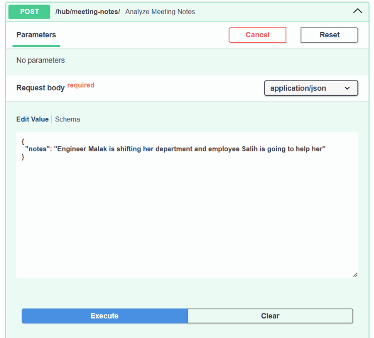
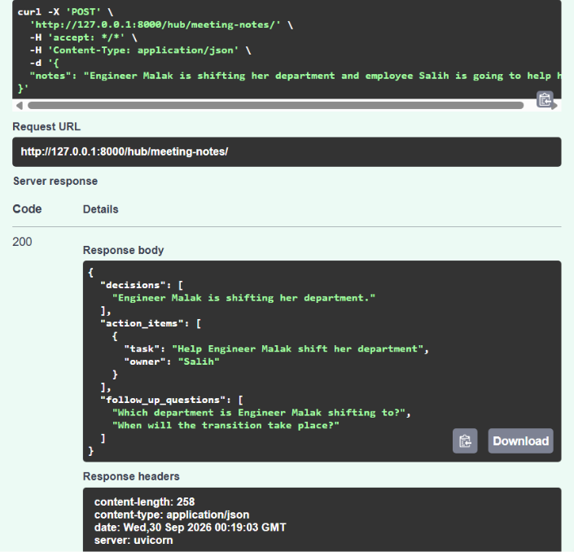

# **My Personal Hub**

##### Description:

A hub of small AI-powered tools for everyday tasks. The first module takes raw meeting notes and returns structured output: decisions made, action items with owners, and suggested follow-up questions.

##### Why I built it

Built while exploring the agentic AI pattern — structuring an app around tools an LLM can call. Also useful for me personally, as a real tool I can keep using and expanding.

##### How it works

* `main.py` — the FastAPI app; each module's router gets attached here
* `routers/meeting_notes.py` — the meeting notes module: defines the request/response shapes and the `POST` endpoint that sends notes to Gemini and returns structured output

##### Setup

1. Clone the repo
2. Create a .env file and attach your gemini API key just like this: `GEMINI_API_KEY=your-key-here`
3. type the command "uv sync"
4. type the command "uvicorn personal_hub.main:app --reload"
5. follow the link "[127.0.0.1:8000/docs#/meeting-notes/analyze_meeting_notes_hub_meeting_notes__post](http://127.0.0.1:8000/docs#/meeting-notes/analyze_meeting_notes_hub_meeting_notes__post)"
6. Try the POST method
7. You should see the output with status code = 200 with the notes spread into decisions field, action items field and follow up questions field.

##### Example Usage

